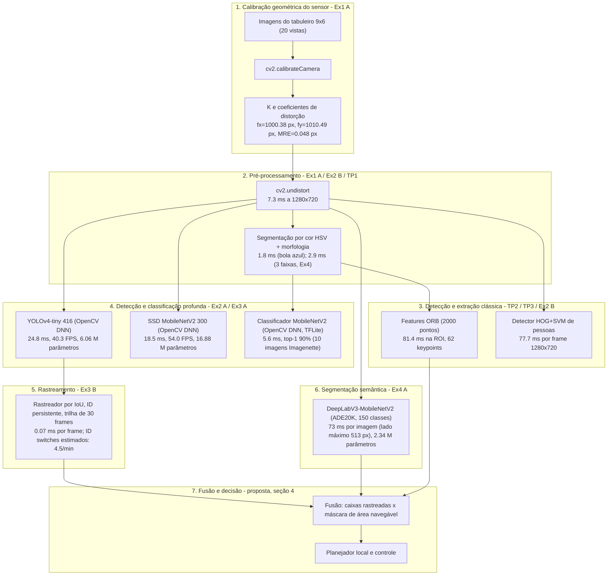
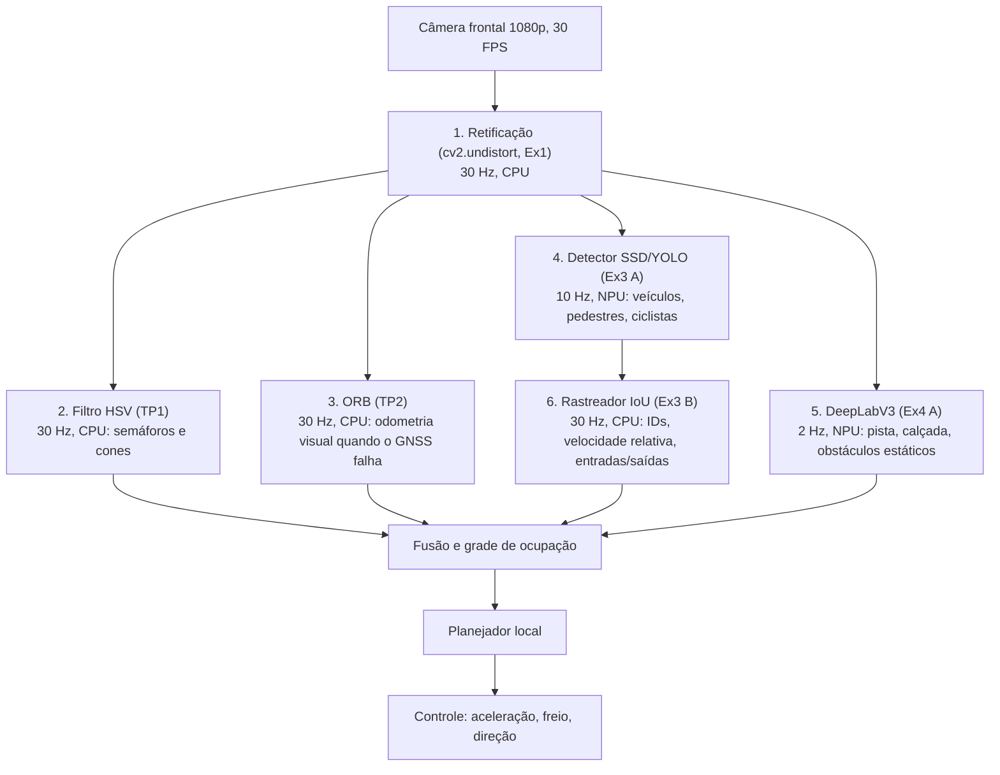

# Relatório Integrativo: Pipeline Completo de Percepção Visual para Veículos Autônomos

**Disciplina:** Visão Computacional / Sistemas Robóticos
**Data:** 23/09/2026
**Ambiente de avaliação:** Python 3.13, OpenCV 4.14.0, TensorFlow 2.21.0, Keras 3.15.1, CPU Intel Core i9-14900KF (desktop, sem GPU)

Todos os números deste relatório foram medidos nas execuções finais dos Exercícios 1 a 4 deste trabalho, na máquina acima. Onde uma métrica não foi medida (por exemplo, mAP em COCO, que exigiria gabarito), isso está dito explicitamente em vez de citar um valor de literatura.

---

## 1. Diagrama do Pipeline Completo de Percepção

O pipeline foi implementado de forma modular ao longo da disciplina, da modelagem do sensor até a segmentação da cena. O diagrama abaixo (Mermaid) mostra o encadeamento calibração → pré-processamento → detecção clássica → detecção profunda → rastreamento → segmentação, com a latência medida de cada bloco.

Descrição dos fluxos:
1. **Calibração:** feita uma vez, alimenta todas as operações geométricas (undistort, solvePnP) com K e distorção.
2. **Pré-processamento:** retifica o frame e isola regiões candidatas por cor.
3. **Detecção clássica:** entrega features (ORB) para associação/odometria e um detector de pessoas sem rede neural (HOG+SVM).
4. **Detecção profunda:** caixas de veículos e pedestres (YOLO/SSD) e classificação de recortes (MobileNetV2).
5. **Rastreamento:** vincula detecções entre frames, atribui ID e conta entradas e saídas.
6. **Segmentação semântica:** rotula cada pixel (pista, calçada, pessoa, carro, prédio, vegetação).
7. **Decisão:** a fusão das caixas rastreadas com a máscara de área navegável define o espaço seguro para o planejador.

As latências indicadas no diagrama são médias por frame ou por imagem, medidas com `time.perf_counter()` em torno de cada etapa, depois de uma fase de aquecimento, e excluem leitura de vídeo, desenho e gravação. Os blocos rodam em sequência num único processo Python; numa arquitetura embarcada eles seriam distribuídos em taxas diferentes, como propõe a seção 4, e parte deles migraria para um acelerador neural.

---

## 2. Tabela Comparativa de Todas as Técnicas com Métricas Reais

Latências por frame ou por imagem medidas em CPU (i9-14900KF), sem GPU, nas resoluções indicadas em cada linha. A coluna de acurácia ou qualidade traz apenas o que foi medido neste trabalho: para os detectores e para o segmentador não há gabarito anotado nos vídeos e imagens usados, então mAP e mIoU aparecem como não medidos, em vez de valores copiados de artigos. A coluna de memória mistura duas grandezas, identificadas em cada linha: RSS do processo, medido com psutil depois do aquecimento, ou tamanho do arquivo de pesos em disco.

| Técnica | Exercício (TP de origem) | Backend | Latência medida (ms) | Taxa (FPS) | Acurácia / qualidade medida | Memória | Complexidade |
| :--- | :---: | :---: | :---: | :---: | :--- | :---: | :--- |
| Calibração de câmera (K, dist) | Ex1 A | OpenCV | < 1 s para 20 vistas (offline) | n/a | MRE 0.048 px; fx e fy com erro < 0.05% em relação ao gabarito sintético | < 10 MB | Otimização não linear (Levenberg-Marquardt) |
| Pose com solvePnP + AR (cubo) | Ex1 B | OpenCV | 17.6 ms por frame (detecção do tabuleiro + PnP + render), 1280x720 | 56.8 | Reprojeção 0.04 a 0.06 px; jitter médio 0.20 px/frame² | ~15 MB | O(N) pontos, iterativo |
| Correção de distorção (undistort) | Ex1 A / Ex2 B | OpenCV | 7.3 (1280x720) | 137 | Retificação das linhas do tabuleiro (visual) | ~25 MB | O(pixels), remapeamento |
| Segmentação por cor HSV | TP1 (Ex2 B, Ex4 A) | OpenCV | 1.8 (1 faixa) a 2.9 (3 faixas) | 200 a 550 | Localiza a bola azul; sem semântica (ver seção 6.3 do Ex4) | < 15 MB | O(pixels), limiarização |
| Features ORB (2000 pontos) | TP2 (Ex2 B) | OpenCV | 81.4 (ROI 261x258) | 12 | 62 keypoints na ROI | ~30 MB | FAST + BRIEF binário |
| Detector HOG+SVM de pessoas | TP3 (Ex2 B) | OpenCV | 77.7 (1280x720, escala 1.05) | 13 | 0 detecções em bola.mp4 (sem pessoas); precisão/recall não medidos | ~45 MB | Janela deslizante multiescala |
| Classificador MobileNetV2 (OpenCV DNN) | Ex2 A | OpenCV DNN (TFLite) | 5.6 | 178 | Top-1 90% (9/10 imagens Imagenette) | 94 MB RSS | 3.5 M parâmetros |
| Classificador MobileNetV2 (Keras) | Ex2 A | TensorFlow CPU | 64.7 | 15 | Top-1 90% (mesmos pesos) | 464 MB RSS | Runtime TensorFlow completo |
| Detector YOLOv4-tiny (416x416) | Ex3 A | OpenCV DNN | 24.8 | 40.3 | 5659 detecções em 795 frames de vtest.avi; mAP não medido (sem gabarito) | 23.1 MB em disco | 6.06 M parâmetros |
| Detector SSD MobileNetV2 (300x300) | Ex3 A | OpenCV DNN | 18.5 | 54.0 | 4942 detecções em 795 frames; mAP não medido | 66.5 MB em disco | 16.88 M parâmetros |
| Rastreador por IoU (ID, trilhas, contagem) | Ex3 B | Python puro | 0.07 | > 10 000 | 53 entradas, 44 saídas em 79.5 s; ID switches estimados 4.5/min (heurística, sem gabarito) | < 5 MB | Associação gulosa O(tracks x detecções) |
| Segmentação DeepLabV3-MobileNetV2 (ADE20K) | Ex4 A | TensorFlow CPU | 73 (lado máximo 513) | 13.8 | 6 cenas; na cena de rua: road 23.2%, sidewalk 4.4%, person 3.7%, car 0.5%; mIoU não medido (sem gabarito) | ~150 MB | 2.34 M parâmetros, ASPP |

---

## 3. Análise de Viabilidade em Hardware Embarcado com Restrição de 5 W

### 3.1 Hipótese de escala
Plataformas de 5 W (Raspberry Pi 4/5, Jetson Nano em modo 5 W, SoCs ARM automotivos de entrada) entregam, por núcleo e sem AVX2, algo entre 6 e 10 vezes menos desempenho que a CPU desktop usada nas medições. Adota-se aqui o fator conservador de 8x sobre as latências medidas; os valores projetados são estimativas de planejamento e devem ser remedidos no hardware alvo.

| Técnica | Latência medida (desktop) | Latência projetada (5 W, 8x) | FPS projetado | Veredito | Recomendação |
| :--- | :---: | :---: | :---: | :---: | :--- |
| Undistort | 7.3 ms | 58 ms | ~17 | Viável | Usar mapas pré-calculados (initUndistortRectifyMap + remap) e resolução menor |
| Segmentação HSV | 1.8 ms | 14 ms | ~69 | Viável | Rodar a 30 FPS em ROIs |
| Features ORB (2000 pts) | 81.4 ms | 651 ms | ~1.5 | Inviável com 2000 pontos | Reduzir para 300 a 500 pontos e usar ROI |
| Rastreador por IoU | 0.07 ms | 0.5 ms | > 1000 | Viável | Custo desprezível |
| Classificador MobileNetV2 (DNN) | 5.6 ms | 45 ms | ~22 | Viável sob demanda | Classificar apenas recortes detectados |
| SSD MobileNetV2 (300) | 18.5 ms | 148 ms | ~6.8 | Limítrofe | Quantizar (INT8) ou usar NPU integrada |
| YOLOv4-tiny (416) | 24.8 ms | 199 ms | ~5.0 | Limítrofe | Entrada 320x320 e INT8 |
| HOG+SVM (1280x720) | 77.7 ms | 622 ms | ~1.6 | Inviável em contínuo | Substituir por SSD/YOLO |
| DeepLabV3-MobileNetV2 (513) | 73 ms | 581 ms | ~1.7 | Inviável por frame | Executar a 1 a 2 Hz e com lado máximo 257 |

### 3.2 Diretrizes para 5 W
1. **Pipeline multi-taxa:** undistort, HSV e rastreador a 30 Hz; detector profundo a 5 a 10 Hz, com o rastreador preenchendo os frames intermediários; segmentação semântica a 1 a 2 Hz, já que a geometria de pista e calçada muda devagar.
2. **Quantização INT8** dos detectores e do segmentador: reduz a memória em cerca de 75% e acelera 2 a 4 vezes em CPUs ARM com NEON ou em NPUs.
3. **Sem runtime de treinamento a bordo:** a comparação do Exercício 2 (94 MB contra 464 MB de RSS, 11.5x na latência) mostra por que o deploy deve usar OpenCV DNN, TFLite ou ONNX Runtime, e não Keras/TensorFlow completo.
4. **Medir no alvo antes de decidir:** o fator de 8x é uma hipótese de planejamento. A decisão final entre SSD e YOLO, e a taxa da segmentação, devem ser tomadas com as latências medidas na própria placa, com o mesmo pipeline, a mesma resolução de entrada e o consumo de energia lido no barramento de alimentação.

---

## 4. Proposta de Arquitetura de Percepção para Veículo Autônomo Urbano

Arquitetura com **6 técnicas** da disciplina, organizada em taxas diferentes:

Detalhamento:
1. **Retificação contínua:** garante que retas do mundo sejam retas na imagem, pré-requisito para estimar distâncias e ângulos.
2. **Filtro HSV:** barato (< 2 ms) e adequado a alvos com cor normatizada (luz de semáforo, cones); nunca usado sozinho para decidir.
3. **ORB para odometria visual:** com 300 a 500 pontos, estima o movimento próprio do veículo em túneis e cânions urbanos.
4. **Detector profundo:** SSD MobileNetV2 quando a latência manda; YOLOv4-tiny quando a memória manda (conclusão do Ex3 A, com o trade-off medido de 1.34x em FPS contra 2.9x em tamanho).
5. **Rastreador por IoU** com predição linear: IDs persistentes e velocidade relativa; a extensão natural é um filtro de Kalman e reidentificação por aparência, que não fazem parte do implementado.
6. **Segmentação semântica:** fornece a máscara de área navegável (road) e as áreas proibidas (sidewalk), que o detector de caixas não distingue.

---

## 5. Identificação de 3 Lacunas a Serem Endereçadas na DR4 (Veículos Autônomos e Robótica Móvel)

### Lacuna 1: escala absoluta e profundidade com câmera monocular
* **Problema observado:** no Exercício 1 a pose só é métrica porque o lado do quadrado (25 mm) é conhecido. Em via pública não há tamanho conhecido: um pedestre a 15 m e uma criança a 10 m produzem caixas parecidas, e a frenagem automática precisa da distância.
* **Endereçamento na DR4:** fusão com LiDAR ou câmera estéreo, que medem profundidade diretamente, e calibração extrínseca câmera-LiDAR.

### Lacuna 2: robustez a iluminação e clima
* **Problema observado:** as técnicas por cor (HSV) dependem de faixas fixas de matiz e saturação; no Exercício 4 a máscara HSV confunde céu, água e sombra, e o próprio DeepLab foi avaliado apenas em cenas diurnas e sem chuva. Chuva, neblina e contraluz não foram testados neste trabalho, e a literatura mostra degradação forte de câmeras RGB nesses casos.
* **Endereçamento na DR4:** sensores complementares (radar 77 GHz, câmera térmica LWIR) e conjuntos de dados com condições adversas para validar a percepção antes do deploy.

### Lacuna 3: rastreamento sob oclusão e métrica de ID switch sem gabarito
* **Problema observado:** o rastreador por IoU do Exercício 3 perde o objeto após 15 frames sem detecção e a métrica de ID switch é uma estimativa heurística (4.5/min), sem gabarito; trocas de ID entre pedestres que se cruzam não são capturadas.
* **Endereçamento na DR4:** rastreamento com reidentificação por aparência (DeepSORT/ByteTrack), filtro de Kalman e avaliação com gabarito MOT (IDF1, MOTA), o que exige anotar ou obter sequências rotuladas.

---

## 6. Conclusão

O pipeline implementado cobre calibração, pré-processamento, detecção clássica e profunda, rastreamento e segmentação, com todas as latências medidas na mesma máquina. Os números mostram o padrão esperado: técnicas clássicas custam poucos milissegundos e não têm semântica; redes profundas custam de 5 ms (classificador) a 73 ms (segmentação) e entregam a semântica que um veículo autônomo precisa. A arquitetura proposta combina as duas famílias em taxas diferentes, e as três lacunas listadas são o que separa este protótipo de um sistema de percepção veicular. Fica também registrado o que não foi medido: acurácia dos detectores e do segmentador contra gabarito, comportamento sob chuva e à noite, e ID switches reais em vez de estimados. Esses pontos definem o plano de validação da próxima disciplina, e nenhum deles é resolvido só com mais processamento: exigem dados anotados e sensores complementares.
